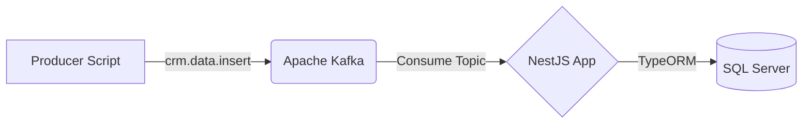

# 📊 CRM Data Ingestion Service

 
 


โปรเจกต์นี้เป็น **Microservice** ที่พัฒนาด้วย **NestJS** มีหน้าที่หลักในการรับข้อมูล (Ingest) ของระบบ CRM ผ่านทาง **Apache Kafka** แล้วนำไปจัดเก็บลงในฐานข้อมูล **Microsoft SQL Server (MSSQL)** อย่างเป็นระบบ โดยใช้ TypeORM ในการจัดการ Database

---

## 🏗 Architecture (สถาปัตยกรรม)



1. **Producer Script**: จำลองส่งข้อมูล (Mock Data) ไปยัง Kafka
2. **Kafka (Message Broker)**: รับและพักข้อมูลไว้ที่ Topic `crm.data.insert`
3. **NestJS Service**: คอย Listen ที่ตัว Kafka ทันทีที่มี Message เข้ามา มันจะดึงข้อมูลนั้นมาโปรเซส
4. **SQL Server**: เก็บข้อมูลลง Table อัตโนมัติด้วย TypeORM (Synchronize=true)

---


## 📋 Prerequisites (สิ่งที่ต้องมี)

ก่อนจะรันโปรเจกต์นี้ ขอให้ตรวจเช็คว่าในเครื่องติดตั้งสิ่งเหล่านี้ไว้แล้ว:
* **Node.js** (แนะนำเวอร์ชัน 18 ขึ้นไป)
* **Docker** และ **Docker Compose** (สำหรับรัน Kafka, Zookeeper, SQL Server)
* **npm** (มาพร้อมกับ Node.js)

---

## 🚀 Installation & Setup (การติดตั้งและการรัน)

### 1. Clone & Install Dependencies
เปิด Terminal ในโฟลเดอร์โปรเจกต์ แล้วรันคำสั่ง:
```bash
npm install
```

### 2. Start Infrastructure (Kafka & SQL Server)
เราใช้ Docker Compose ในการรัน Service จำเป็นทั้งหมด (Zookeeper, Kafka, MSSQL) 
เพื่อให้ง่ายต่อการทดสอบ โดยรันแบบ Background (`-d`):
```bash
docker-compose up -d
```
> 💡 *Note: รอสัก 1-2 นาทีให้ Docker Container ทั้ง 3 ตัวรันขึ้นมาอย่างสมบูรณ์ โดยเฉพาะ Kafka และ SQL Server*

### 3. Start Application
โปรเจกต์ NestJS สามารถรันได้ด้วยคำสั่งด้านล่าง (แนะนำให้รันแบบ Dev เพื่อทดสอบ):
```bash
npm run start:dev
```
เมื่อแอปรันสำเร็จ คุณจะเห็นข้อความใน Console ว่า NestJS เชื่อมต่อกับ Database (MSSQL) และ Kafka เรียบร้อยแล้ว! 🎉

---

## 🧪 Testing Data Ingestion (ทดสอบส่งข้อมูล)

เพื่อความง่าย เราได้เตรียมโค้ดสำหรับส่งข้อมูลจำลองเข้าไปที่ Kafka ไว้แล้ว! 
ลองเปิด Terminal ใหม่อีกหน้าต่าง (ปล่อยหน้าต่างรัน NestJS ทิ้งไว้) แล้วรัน:

```bash
npm run test:produce
```

**สิ่งที่จะเกิดขึ้น:**
1. สคริปต์ `scripts/producer.js` จะต่อเข้ากับ Kafka ที่พอร์ต `localhost:9092`
2. ส่ง Message จำลองเข้า Topic `crm.data.insert` เช่น:
   ```json
   {
     "name": "Somchai Jaidee",
     "email": "somchai.j@example.com",
     "phone": "0812345678",
     "action": "REGISTER_NEW_USER"
   }
   ```
3. แอป NestJS ของเราที่กำลังรันอยู่ จะถูกปลุกให้มารับ Message และนำไปบันทึกลง SQL Server (ในตาราง CrmData) ทันที!

---

## 📂 Project Structure (โครงสร้างโปรเจกต์)

```text
crm-data-ingest/
├── docker-compose.yml     # ไฟล์รัน Kafka, Zookeeper, MSSQL ดัวย Docker
├── scripts/
│   └── producer.js        # สคริปต์เขียนง่ายๆ ด้วย Node สำหรับทดสอบส่ง Event ใส่ Kafka
├── src/
│   ├── crm/               # Module หลักที่มีการทำ Kafka Consumer และเชื่อม SQL Server
│   │   ├── entities/      # TypeORM Entity สำหรับตารางใน Database
│   │   ├── crm.controller.ts # Kafka Listener รับ Topic 'crm.data.insert'
│   │   ├── crm.service.ts    # Service จัดการ Logic เอาข้อมูลเซฟลง DB
│   │   └── crm.module.ts
│   ├── app.module.ts      # กำหนด Config TypeORM ต่อเชื่อมกับ MSSQL ไว้ที่นี่
│   └── main.ts            # ไฟล์ทางเข้าหลัก เพื่อตั้งค่า Microservice 
└── package.json
```

---

## 💡 Important Configurations (ข้อควรจำตั้งค่า)

ใน `app.module.ts` มีการตั้งค่า TypeORM เป็น default ไว้ดังนี้:
* **Host:** `localhost`
* **Port:** `1433`
* **User:** `sa`
* **Password:** `12345`
* **Database:** `crm-database` *(ใช้ crm-database ไปก่อนสำหรับการเทส)*
